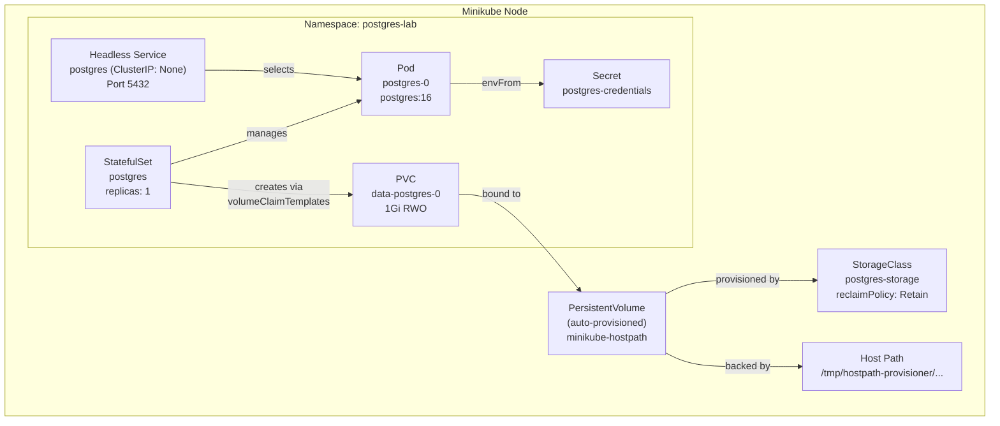
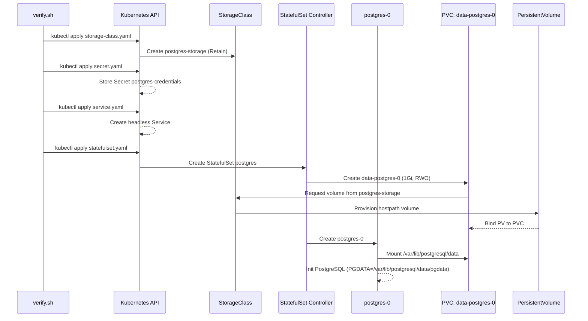
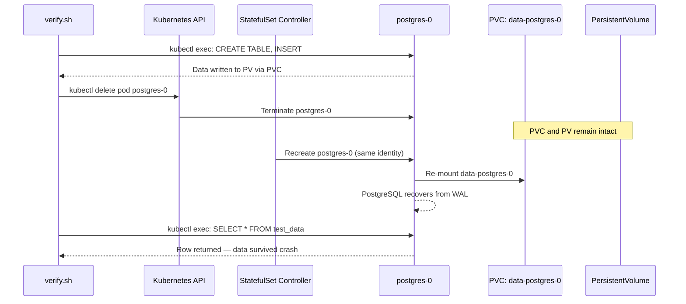
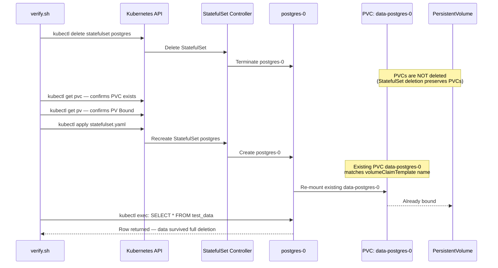
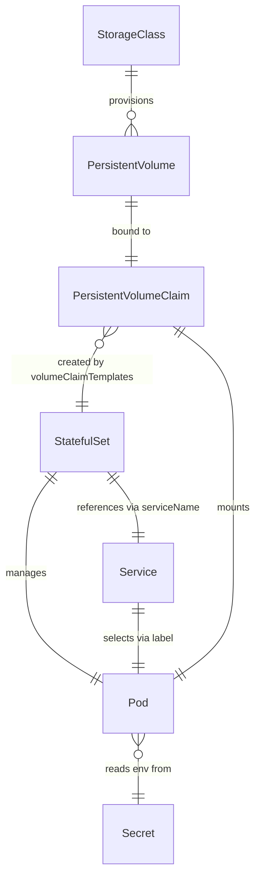

# Design Document: PostgreSQL StatefulSet Lab on Minikube

## Overview

This lab provides a hands-on exercise for deploying a production-aware PostgreSQL StatefulSet on Minikube. The goal is to demonstrate three critical Kubernetes behaviors: data persistence across pod crashes, data survival after StatefulSet deletion and recreation, and secure credential management via Kubernetes Secrets.

The lab creates a custom StorageClass with `reclaimPolicy: Retain` to ensure PersistentVolumes are not deleted when their claims are released. A headless Service provides stable DNS for the StatefulSet pod. A verification script orchestrates the full lifecycle — deploying resources, writing test data, simulating failures, and proving data survives each scenario.

The design targets a single-node Minikube environment with all resources scoped to the `postgres-lab` namespace. The architecture deliberately avoids the default `standard` StorageClass (which uses `reclaimPolicy: Delete`) to teach the difference between Retain and Delete reclaim policies.

## Architecture



## Sequence Diagrams

### Main Deployment Flow



### Crash Recovery Flow (Steps 3–5)



### StatefulSet Deletion & Recreation Flow (Steps 6–9)



## Components and Interfaces

### Component 1: StorageClass (`storage-class.yaml`)

**Purpose**: Defines a custom storage provisioner with Retain reclaim policy to prevent automatic PV deletion.

**Interface**:
```yaml
apiVersion: storage.k8s.io/v1
kind: StorageClass
metadata:
  name: postgres-storage
  # No annotation for default — must NOT be default class
provisioner: k8s.io/minikube-hostpath
reclaimPolicy: Retain
volumeBindingMode: Immediate
allowVolumeExpansion: true
```

**Responsibilities**:
- Provision hostpath-backed PersistentVolumes on Minikube
- Ensure PVs are retained when PVCs are deleted (`reclaimPolicy: Retain`)
- Allow immediate binding without waiting for pod scheduling
- Support volume expansion for future growth

**Key Design Decision**: Using `Retain` instead of `Delete` is the core of the lab. When a PVC is deleted, the PV transitions to `Released` state instead of being destroyed, preserving the underlying data on disk.

### Component 2: Secret (`secret.yaml`)

**Purpose**: Stores PostgreSQL credentials as base64-encoded values, decoupling secrets from workload manifests.

**Interface**:
```yaml
apiVersion: v1
kind: Secret
metadata:
  name: postgres-credentials
  namespace: postgres-lab
type: Opaque
data:
  POSTGRES_USER: <base64(pguser)>
  POSTGRES_PASSWORD: <base64(pgpassword123)>
  POSTGRES_DB: <base64(appdb)>
```

**Responsibilities**:
- Store database credentials securely (base64-encoded)
- Provide env vars to the StatefulSet pod via `envFrom`
- Ensure no hardcoded passwords appear in statefulset.yaml

### Component 3: StatefulSet (`statefulset.yaml`)

**Purpose**: Manages the PostgreSQL pod with stable identity, persistent storage, and secret-based configuration.

**Interface**:
```yaml
apiVersion: apps/v1
kind: StatefulSet
metadata:
  name: postgres
  namespace: postgres-lab
spec:
  serviceName: postgres        # Must match headless Service name
  replicas: 1                  # Single node Minikube constraint
  selector:
    matchLabels:
      app: postgres
  template:
    spec:
      containers:
        - name: postgres
          image: postgres:16
          envFrom:
            - secretRef:
                name: postgres-credentials
          env:
            - name: PGDATA
              value: /var/lib/postgresql/data/pgdata
          resources:
            limits:
              cpu: 500m
              memory: 512Mi
            requests:
              cpu: 250m
              memory: 256Mi
          volumeMounts:
            - name: data
              mountPath: /var/lib/postgresql/data
  volumeClaimTemplates:
    - metadata:
        name: data
      spec:
        storageClassName: postgres-storage
        accessModes: ["ReadWriteOnce"]
        resources:
          requests:
            storage: 1Gi
```

**Responsibilities**:
- Maintain stable pod identity (`postgres-0`)
- Create PVC `data-postgres-0` via volumeClaimTemplates
- Inject credentials from Secret without hardcoding
- Set PGDATA to subdirectory to avoid the `lost+found` mount issue
- Enforce resource limits for production-awareness

**Key Design Decisions**:
- `PGDATA=/var/lib/postgresql/data/pgdata`: PostgreSQL requires PGDATA to be an empty directory on init. Mounting a volume at `/var/lib/postgresql/data` may contain `lost+found` from the filesystem. Setting PGDATA to a subdirectory avoids this.
- `envFrom.secretRef`: Injects all Secret keys as env vars in one declaration, cleaner than individual `secretKeyRef` entries.
- `serviceName: postgres`: Must match the headless Service name for proper DNS resolution (`postgres-0.postgres.postgres-lab.svc.cluster.local`).

### Component 4: Headless Service (`service.yaml`)

**Purpose**: Provides stable DNS entries for StatefulSet pods without load balancing.

**Interface**:
```yaml
apiVersion: v1
kind: Service
metadata:
  name: postgres
  namespace: postgres-lab
spec:
  clusterIP: None              # Headless — required for StatefulSet
  selector:
    app: postgres
  ports:
    - port: 5432
      targetPort: 5432
```

**Responsibilities**:
- Enable DNS resolution: `postgres-0.postgres.postgres-lab.svc.cluster.local`
- No load balancing (headless) — direct pod addressing
- Required by StatefulSet's `serviceName` field

**Key Design Decision**: `clusterIP: None` makes this a headless Service. Unlike a normal ClusterIP Service that provides a single virtual IP, a headless Service creates individual DNS A records for each pod. This is required for StatefulSets to maintain stable network identities.

### Component 5: Verification Script (`verify.sh`)

**Purpose**: Orchestrates the full lab lifecycle — deploy, test, break, recover, verify.

**Responsibilities**:
- Apply all manifests in correct order
- Wait for pod readiness before executing commands
- Write and read test data via `kubectl exec -i` (non-interactive)
- Simulate pod crash and StatefulSet deletion
- Verify data persistence after each failure scenario
- Print educational summary explaining why data survived

## Data Models

### PostgreSQL Test Data Schema

```sql
CREATE TABLE test_data (
    id SERIAL PRIMARY KEY,
    message TEXT NOT NULL,
    created_at TIMESTAMP DEFAULT CURRENT_TIMESTAMP
);

-- Test row
INSERT INTO test_data (message) VALUES ('Hello from Kubernetes StatefulSet lab');
```

**Validation Rules**:
- Table must exist after pod restart (crash recovery)
- Row must be queryable after StatefulSet deletion and recreation (PVC survival)
- `id` auto-increments — proves no data reset occurred

### Kubernetes Resource Relationships



## Correctness Properties

*A property is a characteristic or behavior that should hold true across all valid executions of a system — essentially, a formal statement about what the system should do. Properties serve as the bridge between human-readable specifications and machine-verifiable correctness guarantees.*

### Property 1: No hardcoded credentials in workload manifests

*For any* credential value stored in the Secret's `data` section (decoded from base64), that value SHALL NOT appear as plaintext anywhere in the StatefulSet manifest. This ensures secrets are decoupled from workload definitions.

**Validates: Requirement 2.4**

### Property 2: StatefulSet serviceName matches Headless Service name

*For any* pair of StatefulSet and Service manifests in the lab, the StatefulSet's `spec.serviceName` field SHALL equal the Service's `metadata.name` field. This ensures stable DNS resolution for StatefulSet pods.

**Validates: Requirement 3.2**

### Property 3: All namespaced resources target the lab namespace

*For all* Kubernetes manifests in the lab that define namespaced resources (Secret, Service, StatefulSet), the `metadata.namespace` field SHALL equal `postgres-lab`. This ensures complete namespace isolation.

**Validates: Requirement 8.2**

